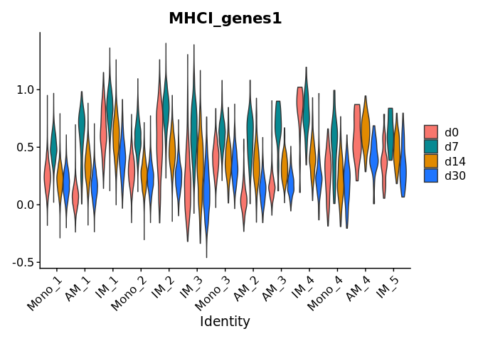
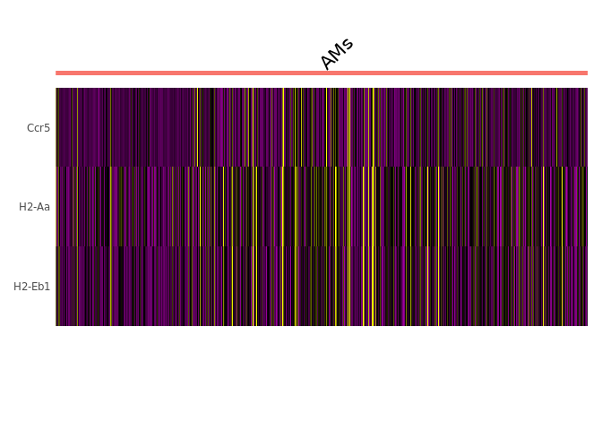
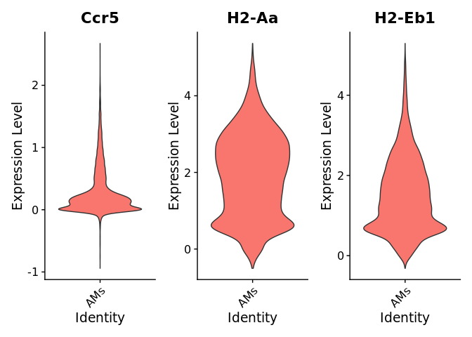
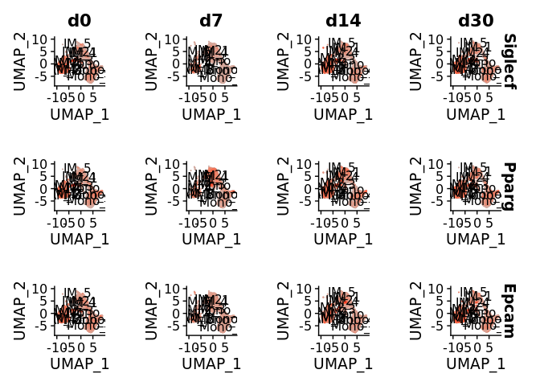
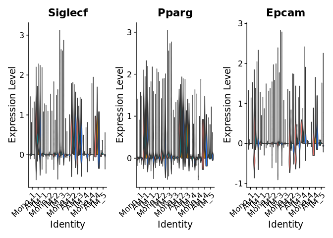

flu_plotting
================
2023-02-17

``` r
library(Seurat)
```

    ## Attaching SeuratObject

    ## Attaching sp

``` r
library(tidyverse)
```

    ## ── Attaching packages
    ## ───────────────────────────────────────
    ## tidyverse 1.3.2 ──

    ## ✔ ggplot2 3.3.6      ✔ purrr   0.3.5 
    ## ✔ tibble  3.1.8      ✔ dplyr   1.0.10
    ## ✔ tidyr   1.2.1      ✔ stringr 1.4.1 
    ## ✔ readr   2.1.3      ✔ forcats 0.5.2 
    ## ── Conflicts ────────────────────────────────────────── tidyverse_conflicts() ──
    ## ✖ dplyr::filter() masks stats::filter()
    ## ✖ dplyr::lag()    masks stats::lag()

``` r
library(cowplot)
# load workspace with objects
load("~/thesis/flu data and prelim analysis/flu_integrated_ws.RData")
```

# Plot out MHC I, II expression

``` r
VlnPlot(flu.integrated.all, features = "MHCI_genes1", group.by = "celltype", split.by = "timepoint", pt.size = 0)
```

    ## The default behaviour of split.by has changed.
    ## Separate violin plots are now plotted side-by-side.
    ## To restore the old behaviour of a single split violin,
    ## set split.plot = TRUE.
    ##       
    ## This message will be shown once per session.

    ## Warning: Groups with fewer than two data points have been dropped.

<!-- -->

``` r
DoHeatmap(flu.plotting.copy, features = c("Ccr5", "H2-Aa", "H2-Eb1")) + NoLegend()
```

<!-- -->

``` r
RidgePlot(object = flu.plotting.copy, features = c("Ccr5", "H2-Aa", "H2-Eb1"))
```

    ## Picking joint bandwidth of 0.0363

    ## Picking joint bandwidth of 0.147

    ## Picking joint bandwidth of 0.123

<!-- -->

``` r
VlnPlot(flu.plotting.copy, features = c("Ccr5", "H2-Aa", "H2-Eb1"), pt.size = 0)
```

<!-- -->

``` r
FeaturePlot(flu.integrated.all, features = c("Siglecf", "Pparg", "Epcam"), max.cutoff = 3, cols = c("grey", "red"), order = T, split.by = "timepoint", label = TRUE)
```

<!-- -->

``` r
VlnPlot(flu.integrated.all, features = c("Siglecf", "Pparg", "Epcam"), pt.size = 0, split.by = "timepoint", group.by = "celltype")
```

    ## Warning: Groups with fewer than two data points have been dropped.
    ## Groups with fewer than two data points have been dropped.
    ## Groups with fewer than two data points have been dropped.

<!-- -->
